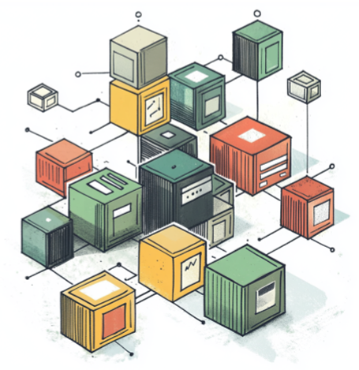
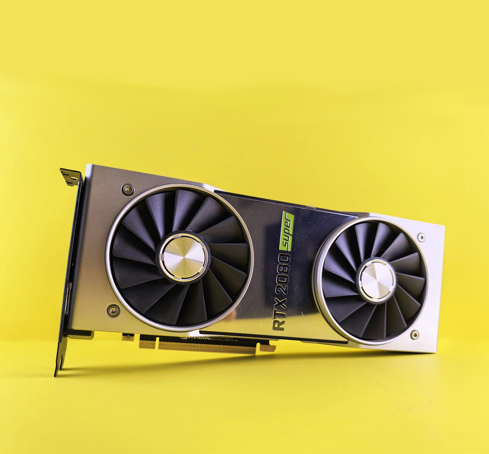
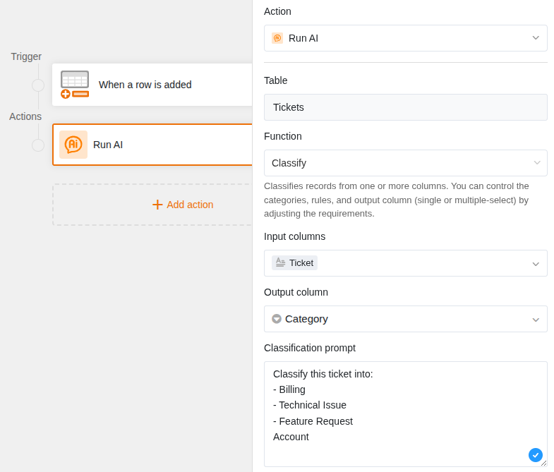
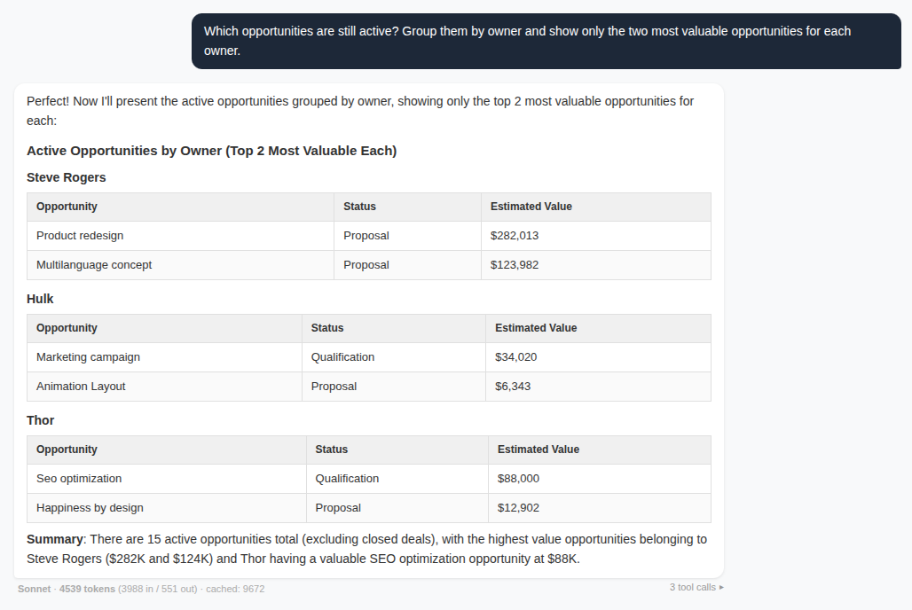
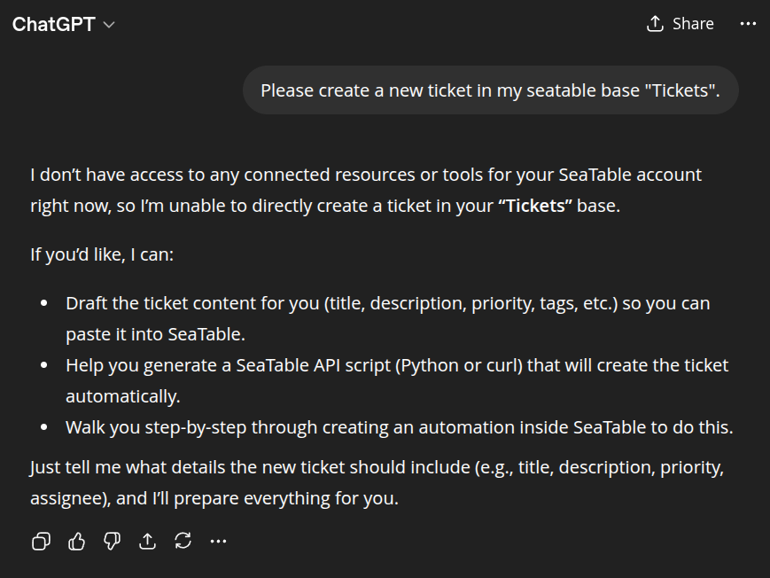

<!-- _header: "" -->
<!-- _footer: "" -->
<!-- _class: first -->

# How to Run Your Own AI

Christoph Dyllick-Brenzinger
CS3 2026 · University of Oslo · March 19th, 2026

<!--
Welcome to the talk. I'm Christoph, co-founder of SeaTable. Yesterday in the status update I showed you what SeaTable can do — including our AI automations. Today I'll tell the story behind it: how we run our own AI server, what works, and where we hit the limits.
-->

---

<!-- _class: scoped -->

# Running Your Own AI

<!--
Let's start at the beginning. What does it actually mean to run your own AI?
-->

---

# It's just a server. With a fat GPU.

<!--
An AI server is no rocket science. It's a regular server — just with a fat GPU inside. You rent it from Hetzner, pay fixed monthly costs, done. No mysterious supercomputer, no data center full of blinking lights.
-->

---

# Our Stack

&nbsp;

### Infrastructure

- **Hetzner GPU Server**
- Fixed monthly cost, predictable

### Serving

- **vLLM**
- Docker

### Model

- **Gemma 3 12B**
- Multimodal: 
text + images
- 12B parameters

<!--
Our stack is simple. At the bottom a GPU server at Hetzner, on top vLLM as the serving framework — that's the industry standard — and on top Gemma 3 12B from Google. Why this model? It's multimodal, so it can process text and images. That was a must for OCR. And 12 billion parameters is the sweet spot: smaller can't reliably solve the tasks, larger doesn't fit on our GPU.
-->

---

<!-- _class: scoped -->

# AI Automations in SeaTable

<!--
So what do we do with this AI server? We use it for AI automations in SeaTable.
-->

---

<!-- _header: "" -->

<!--
As you saw yesterday in the status update: SeaTable 6.0 has five AI automation functions. The principle is always the same: one row as input, the AI processes it, the result goes back into the row. The user doesn't actively wait — it runs in the background. And for these defined tasks, self-hosting works really well.
-->

---

# The real challenges

### Prompting is everything
You want: **"Classify"**

Model returns: *"The category for this ticket is: Billing"*

### Model selection trap
- 4B: not reliably
- **12B: the sweet spot**
- 27B: gets to slow

### Monitoring is mandatory

Token usage, response times, error rates — without monitoring you're flying blind.

<!--
But setting up the hardware is the easy part. The real challenges are different. First: prompting. You want "Billing" as a result — but the model returns "The category for this ticket is: Billing". Sounds trivial, but the automation can't work with prose. That takes a lot of fine-tuning. Second: model selection. We needed image processing, which massively narrowed the choices. 4B can't do the tasks, 27B doesn't fit on the GPU. 12B is the compromise. And third: monitoring. Without monitoring you're flying blind.
-->

---

<cite>Setting up the hardware is the easy part. The real challenges are prompting, model selection, and monitoring.</cite>

<!--
In summary: anyone can set up the server. The real work is in the fine-tuning and the operations.
-->

---

<!-- _class: scoped -->

# Then We Wanted More

<!--
Up to this point it sounds like a success story. Self-hosting works, data stays on your own server, all good. But then we wanted more.
-->

---

# From automation to conversation

> *"Which projects are overdue? Group them by owner."*

The AI answers — not with a guess, but with real data from your base.

<!--
What if the user doesn't just want to process a row, but wants to ask a question? Freely formulated, open, explorative. "Which projects are overdue? Group them by owner." And the AI answers — not with a guess, but with the real data from the base. That's "chat with your data". And it requires something fundamentally different. No longer one row, but entire tables. No longer a defined task, but general analysis. Far more tokens per interaction.
-->

---

<!-- _header: "" -->

# The smart chatbots were ... dump on this...

---

<!-- _class: scoped -->

# MCP Changes Everything

<!--
And the key to making this work is called MCP — Model Context Protocol.
-->

---

# How MCP works

<!--
MCP is an open standard that allows AI models to actively call tools. We built a SeaTable MCP Server. The flow: the user asks a question, the model recognizes it needs data, calls an MCP tool — for example "list_tables" or "find_rows" — gets the real data back, and formulates the answer from it. All live, in real time. No export, no copy-paste.
-->

---

# Without MCP vs. With MCP

| | Without MCP | With MCP |
|---|---|---|
| **Behavior** | AI guesses | AI asks |
| **Data** | Hallucinations | Real data |
| **Response** | *"I don't know your data"* | *"Let me check table X"* |
| **Role** | Passive text generator | Active agent |

<!--
Without MCP the model guesses, hallucinates, or says "I don't know your data". With MCP it actively asks: What tables are there? What's in column X? Show me the linked records. MCP makes the difference between a nice toy and a real tool.
-->

---

# Two-Stage Architecture for Token Optimization

### Stage 1 — Tool Selection
- Only category names, no full schemas
- Last 3 messages only
- Max 256 output tokens
- Result: `["read", "sql"]`

**Cost: minimal**

### Stage 2 — Execution
- Only selected tools with full schemas
- Full chat history (max 10 messages)
- Loop up to 10 iterations
- Full answer with data

**Cost: only what's needed**

**Result: ~40–60% fewer tokens per interaction**

<!--
A technical detail that's interesting for developers in the audience: our two-stage architecture. In Stage 1 the model only gets the category names of the tools — not the full schemas. It only decides: "I need read and sql." That costs almost nothing. Only in Stage 2 does it get the full schemas of the selected tools and the complete chat history. Result: 40-60% fewer tokens per interaction. On top of that: prompt caching — explicit with Anthropic, automatic with OpenAI — and message truncation for old tool results.
-->

---

<!-- _class: scoped -->

# The Reality Check

<!--
Sounds great. But then came the reality check.
-->

---

# Self-hosting hits its limits

### The Capability Problem

MCP requires reliable **tool-calling**:
- Recognize when a tool is needed
- Format the call correctly
- Interpret the result
- Decide if another call is needed

Gemma 3 12B fails at **Stage 1** already — returns prose instead of clean JSON.

### The Speed Problem

One chat answer = **3–5 tool calls**
Each call = inference + execute + process

On our GPU: **too slow for interactive use**

<!--
Gemma 3 12B fails at the chatbot on two fronts. First: reasoning capability. MCP requires reliable tool-calling. The model must recognize when it needs a tool, format the call correctly, interpret the result, and decide if it needs another call. Gemma 3 12B can't do this reliably. Even in Stage 1 — where it only needs to return a simple JSON array — it regularly wraps it in prose. Second: speed. One chat answer needs 3-5 tool calls. Each call means model inference. On our GPU that's far too slow for interactive use.
-->

---

# The solution: Hybrid Architecture

### Automations

- **Process a row**
- Self-hosted **Gemma 3 12B**
- Data stays on your server
- Background processing
- Included in Enterprise plan

### AI Chatbot

- **Chat with your data**
- Bring Your Own Model
- Claude (Haiku, Sonnet)
- OpenAI (GPT-4o, o4-mini)
- Mistral (Large, Small)
- User brings API key

<!--
The pragmatic solution: a hybrid architecture. For automations — defined tasks on single rows — self-hosting remains the right answer. Data doesn't leave the server, performance is acceptable, it runs in the background. For the chatbot you need frontier models with real reasoning capabilities. That's where we go with Bring Your Own Model: the user brings their own API key, currently we support Claude, OpenAI, and Mistral. Transparent — the user pays their own tokens.
-->

---

<!-- _class: scoped -->

# Takeaways

---

# Three things to remember

### 1. Self-hosting works

For defined AI tasks, running your own LLM is feasible and practical.

### 2. MCP is the game-changer

It's the difference between AI that guesses and AI that works with your data.

### 3. The future is hybrid

Self-host where sufficient, frontier models where necessary. Your architecture must support both.

<!--
Three things to take away. First: self-hosting works — for defined AI tasks, running your own LLM server is feasible and practical. Second: MCP is the game-changer — it makes the difference between AI that guesses and AI that actually works with your data. And third: the future is hybrid. Self-host where sufficient, frontier models where necessary. Your architecture must support both.
-->

---

<!-- speaker notes
Thank you very much. This was the presentation:

How to Run Your Own AI: Real-Life Experiences Operating a Self-Hosted Large Language Model for SeaTable Automations

Self-hosting a large language model (LLM) to power AI-driven automations is no longer just a theoretical possibility—it’s a practical reality. In this talk, discover how SeaTable 6.0 integrates AI-powered automations by running a self-hosted LLM on a GPU server at Hetzner using the vLLM framework. Learn about the technical challenges, infrastructure requirements, and operational insights gained from deploying and managing your own AI model in a production SaaS environment. This session offers a unique, hands-on perspective for organizations looking to leverage AI while maintaining full control over their data and customization. Whether you’re exploring AI adoption or seeking alternatives to cloud-only providers, this presentation shares actionable lessons and best practices from real life.

qr-code generated with https://qr.io.
-->

# Interested in this presentation?

- online: https://christophdb.github.io/cs3-2026-how-to-run-your-own-ai/.
- pdf: https://github.com/christophdb/cs3-2026-how-to-run-your-own-ai/blob/main/Slides.pdf